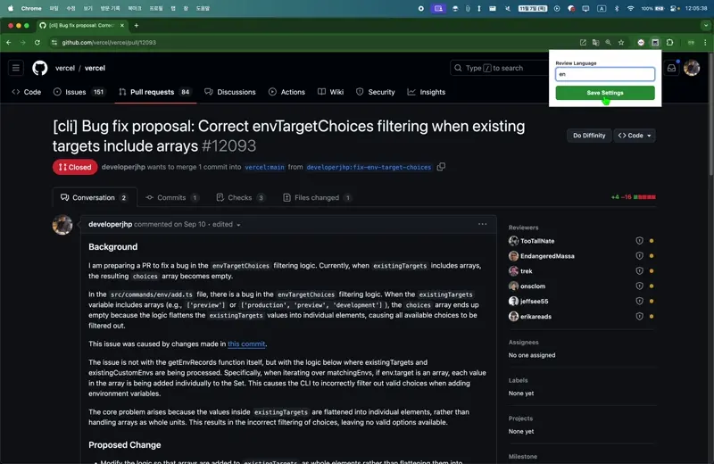

# Diffinity: Get PR Review from LLM in the Simplest Way

Diffinity is a Chrome extension designed to streamline the code review process for GitHub pull requests by automatically fetching the PR diff and preparing a review request in ChatGPT. This extension provides a seamless way to gather and send PR data for analysis and feedback.

## Features

- Adds a "Do Diffinity" button to GitHub pull request pages.
- Fetches the diff data from GitHub PRs.
- Opens a new tab to ChatGPT with the diff data preloaded for review.
- Supports custom review language settings.

## Installation

1. Clone this repository or download the source code as a ZIP file.
2. Open Chrome and navigate to `chrome://extensions/`.
3. Enable "Developer mode" using the toggle in the top right corner.
4. Click "Load unpacked" and select the folder containing the extension files.

## Usage

1. Install the extension.
2. Set the review language by clicking the extension icon and entering your preferred language.
3. Navigate to a GitHub pull request page.
4. Click the "Do Diffinity" button that appears in the pull request header.
5. That's it! The extension will handle the rest and open ChatGPT with the review request.

## Explanation of Key Files

- **background.js**: Contains background event listeners for extension initialization, message handling, and script execution.
- **chatgpt_injector.js**: Injects text into ChatGPT’s input field and simulates a button click to submit the PR review request.
- **content.js**: Injects the "Do Diffinity" button into GitHub PR pages and handles user interactions.
- **popup.html, popup.js, popup.css**: Files for the extension popup interface, allowing users to set their preferred language.
- **manifest.json**: The configuration file defining the extension’s content scripts and background services.

## Contributing

Feel free to fork this repository and submit pull requests. Contributions and feedback are highly appreciated!

## License

This project is licensed under the MIT License.

## Disclaimer

This extension is not affiliated with GitHub or ChatGPT. Use it at your own discretion and ensure compliance with any relevant terms of service.

---

Thank you for using Diffinity. We hope this tool makes your code review process smoother and more efficient!
